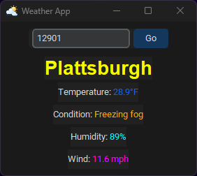

# Weather App

A simple GUI weather application that displays current weather information for a given zip code.

## Features
- Enter a zip code to get current weather
- Displays temperature in Fahrenheit (color-coded: blue ≤32°F, green 33-84°F, red ≥85°F), weather condition (orange), humidity (cyan), wind speed (magenta), and location (yellow)
- Updates automatically every 10 minutes
- Dark theme with custom icon
- Colorful, easy-to-read interface

## Requirements
- Python 3.14
- requests
- customtkinter

## Setup
1. Ensure Python is installed.
2. Create a virtual environment: `python -m venv .venv`
3. Activate the virtual environment: `.venv\Scripts\activate` (Windows)
4. Install dependencies: `pip install requests customtkinter`
5. Obtain an API key from [weatherapi.com](https://www.weatherapi.com/)
6. Copy `config.example.json` to `config.json` and replace `"your_api_key_here"` with your actual API key
7. Run the app: `python weather.py`

## API
Uses weatherapi.com current weather API. API key must be stored in `config.json`.

## License

# IDGAF License ("I Don't Give A Feck")

Permission is hereby granted, free of charge, to any person obtaining a copy of this software and its documentation files ("the Software"), to deal in the Software without restriction, including without limitation the rights to use, copy, modify, merge, publish, distribute, sublicense, and/or sell copies of the Software.

**THE SOFTWARE IS PROVIDED "AS IS," WITHOUT WARRANTY OF ANY KIND, EXPRESS OR IMPLIED, INCLUDING BUT NOT LIMITED TO THE WARRANTIES OF MERCHANTABILITY OR FITNESS FOR A PARTICULAR PURPOSE.**

**IN NO EVENT SHALL THE AUTHORS OR COPYRIGHT HOLDERS BE LIABLE FOR ANY CLAIM, DAMAGES OR OTHER LIABILITY, WHETHER IN AN ACTION OF CONTRACT, TORT OR OTHERWISE, ARISING FROM, OUT OF OR IN CONNECTION WITH THE SOFTWARE OR THE USE OR OTHER DEALINGS IN THE SOFTWARE.**

## Clear Conditions

### Zero Requirement
You are granted all permissions without any conditions. You do not need to retain, reproduce, or include any copyright notice or a copy of this license when you redistribute the Software.

### Total Waiver of Liability
By choosing to use, copy, or modify the Software in any way, you are agreeing to completely and permanently release the original author(s) from all liability. If anything goes wrong, you are entirely responsible.

---

**END**
