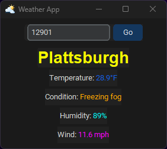

# Weather App

A simple GUI weather application that displays current weather information for a given zip code.

## Features
- Enter a zip code to get current weather
- Displays temperature in Fahrenheit (color-coded: blue ≤32°F, green 33-84°F, red ≥85°F), weather condition (orange), humidity (cyan), wind speed (magenta), and location (yellow)
- Updates automatically every 3 minutes
- Dark theme with custom icon
- Colorful, easy-to-read interface

## Requirements
- Python 3.14
- requests
- customtkinter

## Setup
1. Ensure Python is installed.
2. Create a virtual environment: `python -m venv .venv`
3. Activate the virtual environment: `.venv\Scripts\activate` (Windows)
4. Install dependencies: `pip install requests customtkinter`
5. Obtain an API key from [weatherapi.com](https://www.weatherapi.com/)
6. Create `config.json` with your API key: `{"api_key": "your_key_here"}`
7. Run the app: `python weather.py`

## API
Uses weatherapi.com current weather API. API key must be stored in `config.json`.

## License
This project is licensed under the MIT License - see the [LICENSE](LICENSE) file for details.